# Домашнее задание к занятию 9 «Процессы CI/CD»

## Подготовка к выполнению

1. Создайте два VM в Yandex Cloud с параметрами: 2CPU 4RAM Centos7 (остальное по минимальным требованиям).
Создал 2 vm с помощтю [terraform](./terraform/) 
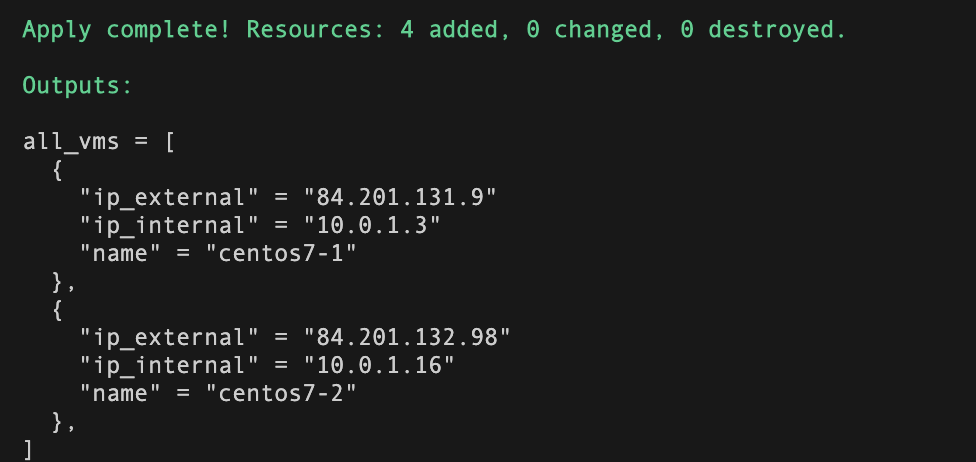

2. Пропишите в [inventory](./infrastructure/inventory/cicd/hosts.yml) [playbook](./infrastructure/site.yml) созданные хосты.
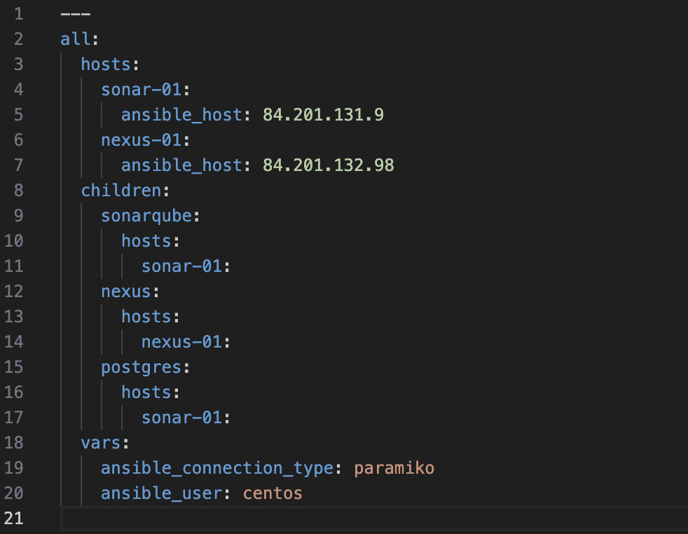

3. Добавьте в [files](./infrastructure/files/) файл со своим публичным ключом (id_rsa.pub). Если ключ называется иначе — найдите таску в плейбуке, которая использует id_rsa.pub имя, и исправьте на своё.
    * Исправил путь к файлу `~/.ssh/id_ed25519.pub`

4. Запустите playbook, ожидайте успешного завершения.
    * Playbook отработал в первый раз с ошибкой, не нашел `postgresql_version: 11`
    * Исправить на `postgresql_version: 12`
    * Еще исправил `/var/lib/pgsql/{{ postgresql_version }}/data/pg_hba.conf`, `/usr/pgsql-{{ postgresql_version }}/bin/postgresql-{{ postgresql_version }}-setup initdb` и `"postgresql-{{ postgresql_version }}"` так как было указано просто 11, если изменить переменную версии то пути нарушались. Исправил на переменную.
    * Дальше ошибок не было:
    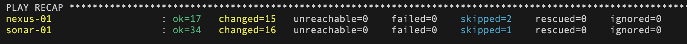

5. Проверьте готовность SonarQube через [браузер](http://localhost:9000).
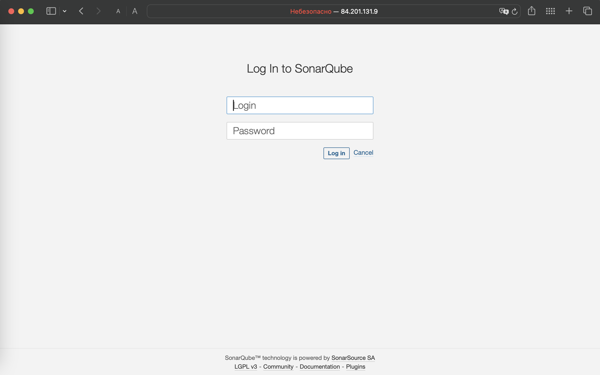

6. Зайдите под admin\admin, поменяйте пароль на свой.
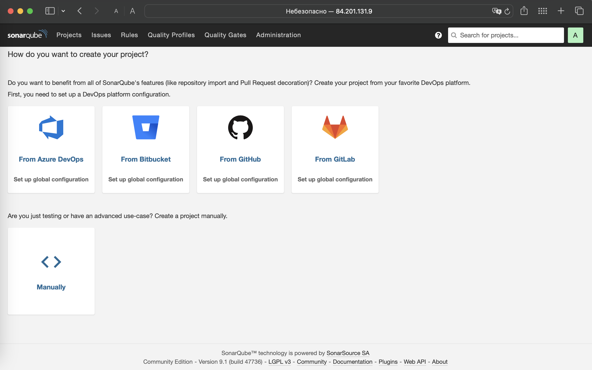

7. Проверьте готовность Nexus через [бразуер](http://localhost:8081).
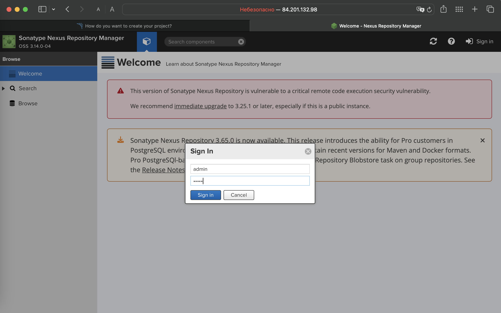

8. Подключитесь под admin\admin123, поменяйте пароль, сохраните анонимный доступ.
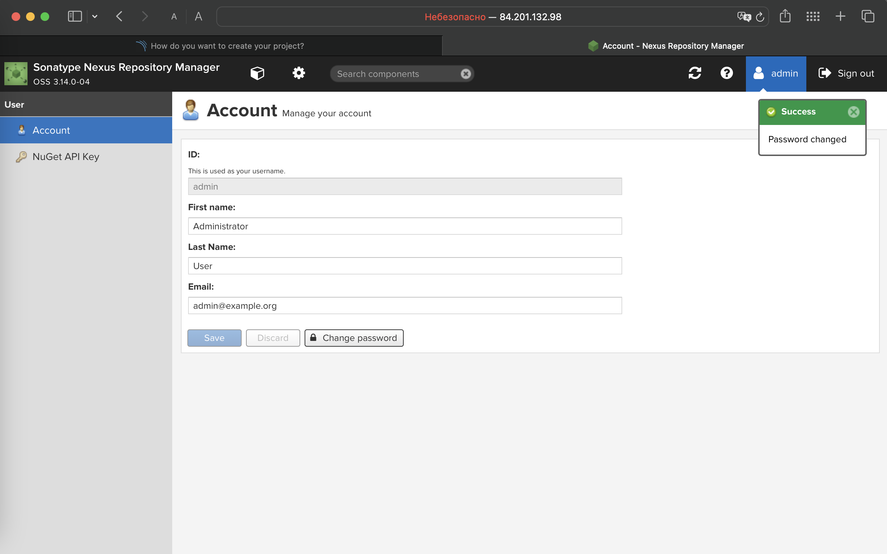

## Знакомоство с SonarQube

### Основная часть

1. Создайте новый проект, название произвольное.
    * Назвал проект `First Project`
2. Скачайте пакет sonar-scanner, который вам предлагает скачать SonarQube.
    * Установил с помощью `HomeBrew` последнюю версию `sonar-scanner`

3. Сделайте так, чтобы binary был доступен через вызов в shell (или поменяйте переменную PATH, или любой другой, удобный вам способ).
4. Проверьте `sonar-scanner --version`.
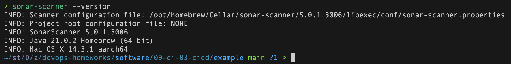

5. Запустите анализатор против кода из директории [example](./example) с дополнительным ключом `-Dsonar.coverage.exclusions=fail.py`.
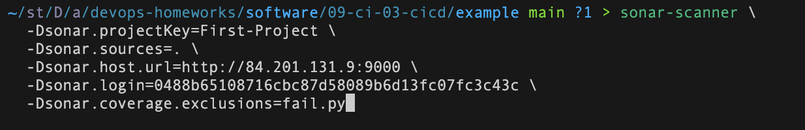

6. Посмотрите результат в интерфейсе.
7. Исправьте ошибки, которые он выявил, включая warnings.
8. Запустите анализатор повторно — проверьте, что QG пройдены успешно.
9. Сделайте скриншот успешного прохождения анализа, приложите к решению ДЗ.
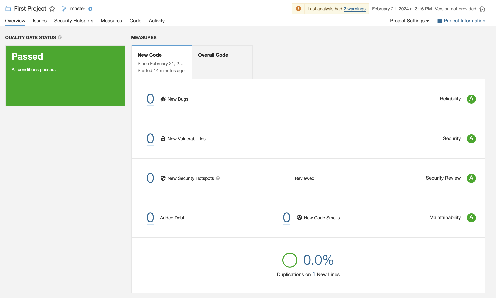

## Знакомство с Nexus

### Основная часть

1. В репозиторий `maven-public` загрузите артефакт с GAV-параметрами:

 *    groupId: netology;
 *    artifactId: java;
 *    version: 8_282;
 *    classifier: distrib;
 *    type: jar.
   
2. В него же загрузите такой же артефакт, но с version: 8_102.
3. Проверьте, что все файлы загрузились успешно.
4. В ответе пришлите файл `maven-metadata.xml` для этого артефекта.
    * [maven-metadata.xml](./example/maven-metadata.xml)

### Знакомство с Maven

### Подготовка к выполнению

1. Скачайте дистрибутив с [maven](https://maven.apache.org/download.cgi).
2. Разархивируйте, сделайте так, чтобы binary был доступен через вызов в shell (или поменяйте переменную PATH, или любой другой, удобный вам способ).
3. Удалите из `apache-maven-<version>/conf/settings.xml` упоминание о правиле, отвергающем HTTP- соединение — раздел mirrors —> id: my-repository-http-unblocker.
4. Проверьте `mvn --version`.
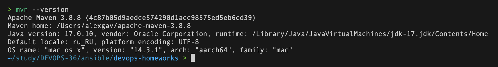

5. Заберите директорию [mvn](./mvn) с pom.

### Основная часть

1. Поменяйте в `pom.xml` блок с зависимостями под ваш артефакт из первого пункта задания для Nexus (java с версией 8_282).

2. Запустите команду `mvn package` в директории с `pom.xml`, ожидайте успешного окончания.
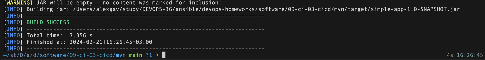

3. Проверьте директорию `~/.m2/repository/`, найдите ваш артефакт.
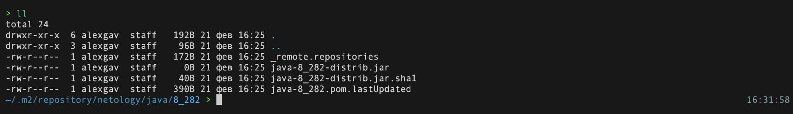

4. В ответе пришлите исправленный файл `pom.xml`.
    * [pom.xml](./mvn/pom.xml)

---

### Как оформить решение задания

Выполненное домашнее задание пришлите в виде ссылки на .md-файл в вашем репозитории.

---
