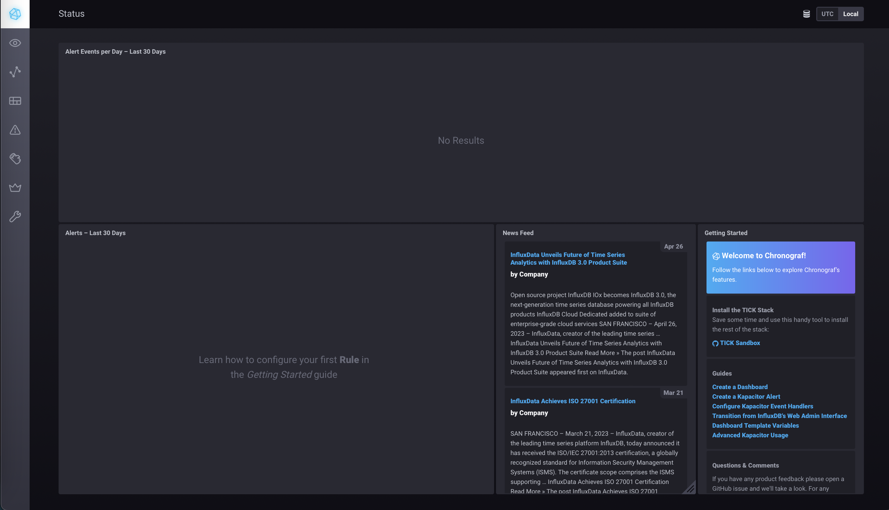
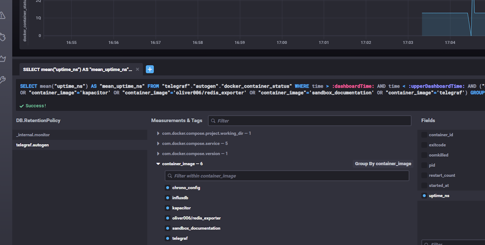

# Домашнее задание к занятию "13.Системы мониторинга"

## Обязательные задания

1. Вас пригласили настроить мониторинг на проект. На онбординге вам рассказали, что проект представляет из себя платформу для вычислений с выдачей текстовых отчетов, которые сохраняются на диск. Взаимодействие с платформой осуществляется по протоколу http. Также вам отметили, что вычисления загружают ЦПУ. Какой минимальный набор метрик вы выведите в мониторинг и почему?

Ответ: Для такой платформы важно мониторить следующие метрики:

- CPU Usage: Поскольку вычисления загружают ЦПУ, нужно следить за его загрузкой, чтобы избежать перегрузок.
- Memory Usage (RAM): Важно контролировать использование оперативной памяти, чтобы выявить возможные утечки памяти или другие проблемы с производительностью.
- Disk I/O и Disk Usage: Поскольку отчеты сохраняются на диск, следует мониторить скорость записи и чтения, а также общее использование дискового пространства.
- HTTP Requests: Мониторинг количества и типа HTTP запросов поможет понять, как клиенты используют платформу.
- Error Rates: Следить за ошибками в запросах, чтобы определить проблемы в работе сервиса.

2. Менеджер продукта посмотрев на ваши метрики сказал, что ему непонятно что такое RAM/inodes/CPUla. Также он сказал, что хочет понимать, насколько мы выполняем свои обязанности перед клиентами и какое качество обслуживания. Что вы можете ему предложить?

Ответ:
Менеджеру продукта следует предложить перевести технические термины в более понятные формулировки:

- CPU Usage - загрузка процессора,
- RAM Usage - использование оперативной памяти,
- Disk I/O - активность по чтению/записи данных на диск.

Для отображения качества обслуживания можно ввести следующие метрики SLA:

- Uptime/Downtime - время безотказной работы системы,
- Response Time - среднее время ответа на запросы клиентов,
- Error Rate - процент запросов, завершившихся с ошибкой.

3. Вашей DevOps команде в этом году не выделили финансирование на построение системы сбора логов. Разработчики в свою очередь хотят видеть все ошибки, которые выдают их приложения. Какое решение вы можете предпринять в этой ситуации, чтобы разработчики получали ошибки приложения?

Ответ: Если финансирование на построение системы сбора логов не выделили, можно использовать опен-сорсные решения:

- ELK Stack (Elasticsearch, Logstash, Kibana) — мощное, но требует ресурсов для установки и обслуживания.
- Fluentd или Fluent Bit — легкие и гибкие инструменты для сбора и агрегации логов.
  Также можно рассмотреть использование локальных файлов логов с возможностью удаленного доступа или периодической репликации данных.

4. Вы, как опытный SRE, сделали мониторинг, куда вывели отображения выполнения SLA=99% по http кодам ответов. Вычисляете этот параметр по следующей формуле: summ_2xx_requests/summ_all_requests. Данный параметр не поднимается выше 70%, но при этом в вашей системе нет кодов ответа 5xx и 4xx. Где у вас ошибка?

Ответ: Если соотношение успешных запросов (2xx) не поднимается выше 70%, стоит проверить:
Классификация запросов: Убедитесь, что все успешные запросы корректно попадают в категорию 2xx.
Наличие других статусов: Проверьте, не учитываются ли в общем числе запросов статусы, такие как 3xx (редиректы или информационные), которые могут быть не ошибками, но и не полностью успешными с точки зрения бизнес-логики.

5. Опишите основные плюсы и минусы pull и push систем мониторинга.

Ответ:
Pull системы (например, Prometheus):

- Плюсы: Контроль за частотой и временем опроса, устойчивость к сбоям агентов.
- Минусы: Трудности в масштабировании, нагрузка на центральный сервер.

Push системы (например, StatsD):

- Плюсы: Легкость масштабирования, агенты могут отправлять данные по своему усмотрению.
- Минусы: Риск потери данных при сбое центрального сервера, большая зависимость от стабильности сети.

6. Какие из ниже перечисленных систем относятся к push модели, а какие к pull? А может есть гибридные?

- Prometheus
- TICK
- Zabbix
- VictoriaMetrics
- Nagios

Ответ: Классификация систем мониторинга

- Prometheus - pull модель.
- TICK (Telegraf, InfluxDB, Chronograf, Kapacitor) - push модель.
- Zabbix - поддерживает и pull, и push модели.
- VictoriaMetrics - поддерживает и pull, и push модели.
- Nagios - в основном pull модель, но имеет возможности для push.

7. Склонируйте себе [репозиторий](https://github.com/influxdata/sandbox/tree/master) и запустите TICK-стэк,
   используя технологии docker и docker-compose.

В виде решения на это упражнение приведите скриншот веб-интерфейса ПО chronograf (`http://localhost:8888`).
Ответ:


P.S.: если при запуске некоторые контейнеры будут падать с ошибкой - проставьте им режим `Z`, например
`./data:/var/lib:Z`

8. Перейдите в веб-интерфейс Chronograf (http://localhost:8888) и откройте вкладку Data explorer.
   - Нажмите на кнопку Add a query
   - Изучите вывод интерфейса и выберите БД telegraf.autogen
   - В `measurments` выберите cpu->host->telegraf-getting-started, а в `fields` выберите usage_system. Внизу появится график утилизации cpu.
   - Вверху вы можете увидеть запрос, аналогичный SQL-синтаксису. Поэкспериментируйте с запросом, попробуйте изменить группировку и интервал наблюдений.

Для выполнения задания приведите скриншот с отображением метрик утилизации cpu из веб-интерфейса.
Ответ:


9. Изучите список [telegraf inputs](https://github.com/influxdata/telegraf/tree/master/plugins/inputs).
   Добавьте в конфигурацию telegraf следующий плагин - [docker](https://github.com/influxdata/telegraf/tree/master/plugins/inputs/docker):

```
[[inputs.docker]]
  endpoint = "unix:///var/run/docker.sock"
```

Дополнительно вам может потребоваться донастройка контейнера telegraf в `docker-compose.yml` дополнительного volume и
режима privileged:

```
  telegraf:
    image: telegraf:1.4.0
    privileged: true
    volumes:
      - ./etc/telegraf.conf:/etc/telegraf/telegraf.conf:Z
      - /var/run/docker.sock:/var/run/docker.sock:Z
    links:
      - influxdb
    ports:
      - "8092:8092/udp"
      - "8094:8094"
      - "8125:8125/udp"
```

После настройке перезапустите telegraf, обновите веб интерфейс и приведите скриншотом список `measurments` в
веб-интерфейсе базы telegraf.autogen . Там должны появиться метрики, связанные с docker.

Ответ:


## Дополнительное задание (со звездочкой\*) - необязательно к выполнению

1. Вы устроились на работу в стартап. На данный момент у вас нет возможности развернуть полноценную систему
   мониторинга, и вы решили самостоятельно написать простой python3-скрипт для сбора основных метрик сервера. Вы, как
   опытный системный-администратор, знаете, что системная информация сервера лежит в директории `/proc`.
   Также, вы знаете, что в системе Linux есть планировщик задач cron, который может запускать задачи по расписанию.

Суммировав все, вы спроектировали приложение, которое:

- является python3 скриптом
- собирает метрики из папки `/proc`
- складывает метрики в файл 'YY-MM-DD-awesome-monitoring.log' в директорию /var/log
  (YY - год, MM - месяц, DD - день)
- каждый сбор метрик складывается в виде json-строки, в виде:

  - timestamp (временная метка, int, unixtimestamp)
  - metric_1 (метрика 1)
  - metric_2 (метрика 2)

    ...

  - metric_N (метрика N)

- сбор метрик происходит каждую 1 минуту по cron-расписанию

Для успешного выполнения задания нужно привести:

а) работающий код python3-скрипта,

б) конфигурацию cron-расписания,

в) пример верно сформированного 'YY-MM-DD-awesome-monitoring.log', имеющий не менее 5 записей,

P.S.: количество собираемых метрик должно быть не менее 4-х.
P.P.S.: по желанию можно себя не ограничивать только сбором метрик из `/proc`.

2. В веб-интерфейсе откройте вкладку `Dashboards`. Попробуйте создать свой dashboard с отображением:

   - утилизации ЦПУ
   - количества использованного RAM
   - утилизации пространства на дисках
   - количество поднятых контейнеров
   - аптайм
   - ...
   - фантазируйте)

   ***

### Как оформить ДЗ?

Выполненное домашнее задание пришлите ссылкой на .md-файл в вашем репозитории.

---
